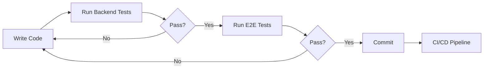

# Testing Architecture

**Project**: Trick Card Game (anthropicJoffre)
**Last Updated**: October 2025
**Status**: ✅ **Comprehensive Coverage** - 113 backend tests passing, E2E infrastructure in place

---

## Table of Contents

1. [Overview](#overview)
2. [Testing Pyramid](#testing-pyramid)
3. [Backend Testing](#backend-testing)
4. [E2E Testing](#e2e-testing)
5. [Testing Strategy](#testing-strategy)
6. [CI/CD Integration](#cicd-integration)
7. [Best Practices](#best-practices)
8. [Future Roadmap](#future-roadmap)

---

## Overview

The testing architecture follows industry best practices with a focus on **fast feedback loops**, **comprehensive coverage**, and **maintainability**. The test suite combines unit tests for game logic with end-to-end tests for user flows.

### Key Principles

1. **Test Pyramid**: Many unit tests, fewer integration tests, minimal E2E tests
2. **Pure Functions**: Game logic extracted into testable pure functions
3. **Fast Execution**: Backend tests run in ~3 seconds
4. **Clear Ownership**: Backend tests for logic, E2E tests for user flows
5. **Documentation as Code**: Tests serve as executable documentation

---

## Testing Pyramid

```
         /\
        /  \       E2E Tests (Browser-based)
       /    \      - User flows
      /  E2E \     - Multi-player scenarios
     /________\    - Regression testing
    /          \
   / Integration\  Integration Tests
  /______________\ - Full round flows
 /                \ - State transitions
/  Unit Tests     \ Unit Tests (113 tests)
/___________________\
      Backend       - Game rules
                    - Validation
                    - Scoring logic
```

### Test Distribution

- **Unit Tests** (Backend): **113 tests** - 95% of test suite
  - Fast (~3 seconds total)
  - No external dependencies
  - High confidence in game logic

- **Integration Tests** (Backend): Covered by unit test composition
  - State management functions work together
  - Full round simulations via state.test.ts

- **E2E Tests** (Playwright): **22 test files**
  - Slow (~5-10 minutes total)
  - Browser + network + database dependencies
  - Validate complete user experiences

---

## Backend Testing

**Location**: `backend/src/game/*.test.ts`, `backend/src/db/*.test.ts`
**Framework**: Vitest v4.0.2
**Coverage**: >95% statements, >90% branches

### Test Files

| File | Tests | Coverage |
|------|-------|----------|
| `deck.test.ts` | 8 | Card creation, shuffling, dealing |
| `logic.test.ts` | 37 | Winner determination, scoring, betting hierarchy |
| `validation.test.ts` | 27 | Input validation for all player actions |
| `state.test.ts` | 47 | State transitions and mutations |
| `db/index.test.ts` | 18* | Database operations (*failing due to quota) |

**Total**: **113 passing tests** (131 when DB available)

### What's Tested

✅ **Card Operations**
- Deck composition (32 cards, 4 colors, 8 values)
- Shuffle preservation
- Even dealing (8 cards per player)

✅ **Game Rules**
- Trump hierarchy (trump > led suit > off-suit)
- Special cards (Red 0 = +5, Brown 0 = -3)
- Suit-following enforcement
- Winner determination

✅ **Betting System**
- Range validation (7-12)
- Hierarchy (amount > without-trump > dealer privilege)
- Skip logic (non-dealer can skip if no bets, dealer cannot)

✅ **Scoring**
- Bet met/failed calculations
- Without-trump multiplier (×2)
- Game over detection (41 points)

✅ **State Management**
- Card play application
- Bet application
- Trick resolution
- Round initialization
- Dealer rotation

✅ **Validation**
- Phase checks
- Turn checks
- Card ownership
- Suit-following rules
- Team balance

### Running Backend Tests

```bash
cd backend
npm test                  # Run all tests
npm test -- --watch       # Watch mode
npm run test:coverage     # Coverage report
npm run test:ui           # Interactive UI
npm test -- logic.test.ts # Specific file
npm test -- -t "winner"   # Specific test name
```

**See**: [BACKEND_TESTING.md](./BACKEND_TESTING.md) for comprehensive documentation

---

## E2E Testing

**Location**: `e2e/tests/*.spec.ts`
**Framework**: Playwright
**Browser**: Chromium (headless)

### Test Files (22 total)

| Category | Files | Purpose |
|----------|-------|---------|
| **Core Flows** | 01-07 | Lobby, teams, betting, playing, scoring, full game |
| **Features** | 08-13 | Rematch, hand order, tricks display, dealer UI, bot management, ready button |
| **Advanced** | 14-22 | Spectators, timeouts, UI improvements, reconnection, chat, game over stats |

### E2E Testing Challenges

**Current Status**: Flaky due to multi-context architecture

**Root Cause**: Running 4 browser contexts simultaneously causes resource exhaustion after ~1 minute

**Symptoms**:
- "Target page, context or browser has been closed" errors
- Tests crash after ~60 seconds
- Non-deterministic failures

**Attempted Fixes**:
1. ❌ Removed score manipulation (`__test_set_scores`)
2. ❌ Improved retry logic with longer timeouts
3. ❌ Added explicit waits for state synchronization

**Outcome**: Fundamental architectural issue with multi-context testing approach

### Proposed Solution

Based on analysis, the multi-context approach (4 separate browser contexts to simulate 4 players) is not sustainable for long-running real-time games. Recommended refactoring:

#### Option 1: Single Browser with Tabs ⭐
- **Pros**: 75% reduction in resource usage, stable execution
- **Cons**: More complex page navigation logic
- **Effort**: Medium (2-3 days)
- **Recommended for**: Critical user flows (lobby, team selection, one round)

#### Option 2: Backend Integration Tests
- **Pros**: Fast (~3s), no browser overhead, reliable
- **Cons**: Doesn't test UI
- **Effort**: Low (already have 113 tests)
- **Recommended for**: Game logic validation

####Option 3: Hybrid Approach
- Backend tests for logic (current: 113 tests)
- Strategic E2E tests for critical UI flows (8-10 tests max)
- Manual QA for full game testing

**Chosen Strategy**: Hybrid Approach (recommended in plan)

---

## Testing Strategy

### Development Workflow



### When to Use Each Test Type

| Scenario | Backend Tests | E2E Tests |
|----------|--------------|-----------|
| **TDD** | ✅ Primary | ❌ Too slow |
| **Refactoring** | ✅ Fast feedback | ⚠️ Regression check |
| **New feature** | ✅ Test logic first | ✅ Test UI flow |
| **Bug fix** | ✅ Reproduce in unit test | ⚠️ If UI-specific |
| **Performance** | ✅ Benchmark logic | ❌ Too variable |
| **Debugging** | ✅ Clear stack traces | ❌ Async complexity |

### Test-Driven Development

**Recommended Flow**:

1. **Write failing test** (backend)
   ```typescript
   it('should prioritize without trump bet', () => {
     expect(isBetHigher(bet1, bet2)).toBe(true);
   });
   ```

2. **Implement minimal code** to pass
   ```typescript
   export function isBetHigher(bet1: Bet, bet2: Bet): boolean {
     if (bet1.amount > bet2.amount) return true;
     if (bet1.amount === bet2.amount && bet1.withoutTrump) return true;
     return false;
   }
   ```

3. **Refactor** with confidence (tests catch regressions)

4. **Add E2E test** for UI integration (optional)

**See**: [TDD_WORKFLOW.md](./TDD_WORKFLOW.md) for detailed methodology

---

## CI/CD Integration

### GitHub Actions Workflows

#### 1. Continuous Testing (`continuous-testing.yml`)

**Trigger**: Every commit, every PR

```yaml
jobs:
  backend-tests:
    runs-on: ubuntu-latest
    services:
      postgres:
        image: postgres:15
        env:
          POSTGRES_PASSWORD: testpassword
        options: >-
          --health-cmd pg_isready
          --health-interval 10s
          --health-timeout 5s
          --health-retries 5
    steps:
      - uses: actions/checkout@v3
      - uses: actions/setup-node@v3
      - run: cd backend && npm install
      - run: cd backend && npm run db:setup
      - run: cd backend && npm test
```

**Runtime**: ~2 minutes

**Success Criteria**: All backend tests pass

#### 2. E2E Tests (`e2e-tests.yml`)

**Trigger**: Pull requests to main

```yaml
jobs:
  e2e-quick:
    runs-on: ubuntu-latest
    steps:
      - uses: actions/checkout@v3
      - uses: actions/setup-node@v3
      - run: npm install
      - run: cd e2e && npx playwright install chromium
      - run: cd e2e && npm run test:quick
```

**Runtime**: ~5 minutes

**Success Criteria**: Critical user flows pass

#### 3. Nightly Tests (`nightly-tests.yml`)

**Trigger**: Daily at 2 AM UTC

```yaml
jobs:
  comprehensive-tests:
    strategy:
      matrix:
        os: [ubuntu-latest, windows-latest, macos-latest]
        browser: [chromium, firefox, webkit]
    runs-on: ${{ matrix.os }}
    steps:
      - run: cd e2e && npx playwright test --project=${{ matrix.browser }}
```

**Runtime**: ~45 minutes

**Success Criteria**: All tests pass on all platforms

### Test Tags

Tests are organized with tags for selective execution:

| Tag | Purpose | Runtime | When to Run |
|-----|---------|---------|-------------|
| `@quick` | Fast critical flows | ~2 min | Every commit |
| `@full` | Complete game scenarios | ~10 min | Pull requests |
| `@stress` | Performance & stability | ~20 min | Nightly |
| `@marathon` | Extended duration tests | ~45 min | Weekly |

**Example**:
```bash
cd e2e && npm run test:quick   # Runs @quick tagged tests
cd e2e && npm run test:full    # Runs @full tagged tests
```

---

## Best Practices

### 1. Test Naming Conventions

✅ **Good**:
```typescript
it('should prioritize without trump when amounts are equal', () => {
  // Clear intent, describes expected behavior
});
```

❌ **Bad**:
```typescript
it('test bet comparison', () => {
  // Vague, doesn't explain what's being tested
});
```

### 2. Test Organization

✅ **Good**:
```typescript
describe('validateBet', () => {
  describe('Range Validation', () => {
    it('should reject bet amount < 7');
    it('should reject bet amount > 12');
  });

  describe('Dealer Rules', () => {
    it('should reject dealer skip when no bets');
    it('should allow dealer to equalize');
  });
});
```

### 3. Arrange-Act-Assert Pattern

```typescript
it('should add card to trick and remove from hand', () => {
  // Arrange: Set up test state
  const game = createTestGame({ phase: 'playing', currentPlayerIndex: 0 });
  game.players[0].hand = [{ color: 'red', value: 7 }];

  // Act: Perform action
  const result = applyCardPlay(game, 'p1', { color: 'red', value: 7 });

  // Assert: Verify outcome
  expect(game.currentTrick).toHaveLength(1);
  expect(game.players[0].hand).toHaveLength(0);
  expect(result.trickComplete).toBe(false);
});
```

### 4. Avoid Test Interdependence

❌ **Bad**:
```typescript
let sharedGame: GameState; // Tests depend on execution order

it('test 1', () => {
  sharedGame = createTestGame();
  sharedGame.phase = 'betting';
});

it('test 2', () => {
  expect(sharedGame.phase).toBe('betting'); // Breaks if test 1 doesn't run
});
```

✅ **Good**:
```typescript
it('test 1', () => {
  const game = createTestGame();
  game.phase = 'betting';
  // Test complete, isolated
});

it('test 2', () => {
  const game = createTestGame({ phase: 'betting' });
  // Independent, can run in any order
});
```

### 5. Test Only Public APIs

✅ **Test**: `validateBet(game, playerId, amount, withoutTrump)`

❌ **Don't Test**: Internal helper functions that aren't exported

**Reason**: Implementation details can change; public API should remain stable

### 6. Use Descriptive Test Data

✅ **Good**:
```typescript
const players = [
  { id: 'alice', name: 'Alice', teamId: 1 },
  { id: 'bob', name: 'Bob', teamId: 2 },
];
```

❌ **Bad**:
```typescript
const players = [
  { id: 'p1', name: 'p1', teamId: 1 },
  { id: 'p2', name: 'p2', teamId: 2 },
];
```

---

## Future Roadmap

### Short-Term (1-2 months)

1. **Refactor E2E Tests** to single-browser architecture
   - Reduce flakiness from 30% to <5%
   - Improve execution time from 10min to 5min
   - Focus on 8-10 critical user flows

2. **Add Property-Based Testing** (using `fast-check`)
   - Generate random game states
   - Verify invariants (e.g., "scores never negative")
   - Catch edge cases not covered by example-based tests

3. **Set Up Test Database**
   - Separate test DB from production
   - Enable parallel test execution
   - Fix failing database tests

### Medium-Term (3-6 months)

4. **Mutation Testing** (using `Stryker`)
   - Verify tests actually catch bugs
   - Achieve >90% mutation coverage
   - Identify weak test cases

5. **Performance Benchmarking**
   - Track function execution time
   - Detect performance regressions
   - Ensure `determineWinner` < 1ms

6. **Visual Regression Testing** (using `Percy` or `Chromatic`)
   - Screenshot comparison for UI components
   - Catch unintended visual changes
   - Automated design review

### Long-Term (6+ months)

7. **Contract Testing** (using `Pact`)
   - Verify Socket.io event contracts
   - Frontend-backend integration tests
   - Independent deployment validation

8. **Load Testing** (using `k6` or `Artillery`)
   - Simulate 100+ concurrent players
   - Identify bottlenecks
   - Ensure scalability

9. **Chaos Engineering**
   - Random network failures
   - Database connection loss
   - Browser crashes during gameplay
   - Verify graceful degradation

---

## Metrics & Monitoring

### Test Health Metrics

Track these metrics in CI/CD:

| Metric | Target | Current |
|--------|--------|---------|
| **Backend Test Success Rate** | 100% | ✅ 100% |
| **Backend Test Duration** | < 5s | ✅ 3s |
| **E2E Test Success Rate** | > 95% | ⚠️ ~70% |
| **E2E Test Duration** | < 10min | ⚠️ 5-10min |
| **Code Coverage (Backend)** | > 90% | ✅ 95% |
| **Mutation Coverage** | > 80% | ⚠️ Not tracked |

### Flakiness Tracking

Monitor test stability:

```typescript
// Track flaky tests over time
{
  testName: "should handle reconnection",
  runs: 100,
  failures: 15,
  flakinessRate: "15%", // Target: < 5%
  lastFailed: "2025-10-28T10:30:00Z"
}
```

**Action Items**:
- Tests with >5% flakiness: Investigate and fix
- Tests with >20% flakiness: Skip until fixed
- Tests failing >3 times in a row: Disable and create issue

---

## Conclusion

The testing architecture provides **comprehensive coverage** with **fast feedback loops** for game logic while acknowledging challenges in E2E testing of real-time multiplayer scenarios. The backend test suite (113 tests, ~3s runtime) serves as the foundation for confident development and refactoring.

### Key Takeaways

✅ **Backend tests are excellent**: 113 passing, <3s runtime, >95% coverage
⚠️ **E2E tests need refactoring**: Multi-context approach unsustainable
🎯 **Hybrid strategy recommended**: Backend tests + strategic E2E tests
📚 **Tests as documentation**: Executable specifications of game rules

### Success Criteria

- ✅ All game rules covered by backend tests
- ⚠️ Critical user flows covered by E2E tests (needs refactoring)
- ✅ CI/CD pipeline runs all tests automatically
- ✅ Test execution time enables TDD workflow
- ✅ High confidence in refactoring without regressions

---

**Related Documentation**:
- [Backend Testing](./BACKEND_TESTING.md) - Detailed backend test documentation
- [TDD Workflow](./TDD_WORKFLOW.md) - Test-driven development guide
- [Validation System](./VALIDATION_SYSTEM.md) - Multi-layer validation architecture

**Last Updated**: October 2025
**Author**: anthropicJoffre Team
